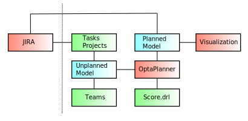

# kapa

This software is based on [OptaPlanner](https://www.optaplanner.org/)

## Planning constraints

### Hard constraints
* Team skills
    * Teams are responsible for maintenance of modules created by them
    * New modules are distributed according to following constraints
        * Product features should be preferably developed by core teams
        * Customer specific one-time modules should be preferably developed by external teams
* Task dependencies
    * Some tasks must be finished before others
        * Analysis must be finished before the development can start
        * Platform feature required before customer-specific module can start development
        
### Soft constraints

* Minimize cost of delay
    * Not delivering committed feature on time leads to unsatisfied customers and even to penalties
    * Not creating a product feature lowers competitiveness and may even lead to loosing projects
    * Delivering  product feature ahead of schedule might be rewarding and therefore lead to negative costs of delay
* High team utilization
    * Teams should be fully utilized

## Domain model

Abbreviations:
* **f** - fact
* **a** - anchor
* **v** - planning variable
* **s** - shadow variable

### Team

* **f: Skills** - for example module development, analysis, etc.
* **f: Velocity** - net velocity. Might differ from sprint to sprint
* **a: Backlog** - prioritized list of tasks (represented by it's anchor task)

### Task

* **f: Skill** - team skill required for this task
* **f: blockedBy** - list of tasks which must be finished before this task can be started
* **f: leadTime** - lead time needed before this task can be started after all blockers have been finished
* **v: previousTask** - previous task in the backlog, null = unplanned
* **f: work** - amount of work needed
* **s: team** - team to which backlog this task belongs
* **s: due** - previousTask.due + work / team.velocity
* **f: project** - project this task belongs to

Having the task input as a prioritized might help speed up the planning (priority is task strength).

### Project

* **f: due** - project deadline - all tasks must be finished until then
* **f: probability** - probability of project intake
    * projects with 30% intake-probability will only block 30% of capacity
    * **!?** still not persuaded, this is a good idea - let's consider following situation:
        * we have a commitment for 90 of 100 units of our capacity for the next 12 months
        * there is a project in the pipeline with 33% probability worth 30 units of capacity, but it must be finished within the next 12 months
        * our plan will say to go for the project, 33% of 30 units is 10 units
        * getting the project sounds great
        * however in reality the moment we get the project we will have a big problem because of an overcommitment
    * maybe we could add an constraint saying, that no project in the pipeline is allowed to be bigger, than the remaining unplanned capacity 
* **f: costOfDelay** - cost of delay **!?** we start simply with a number, but this topic can get complex
* **f: tasks** - tasks belonging to this project
* **s: delay** - how much is the last planned task after due of project

### Skill

