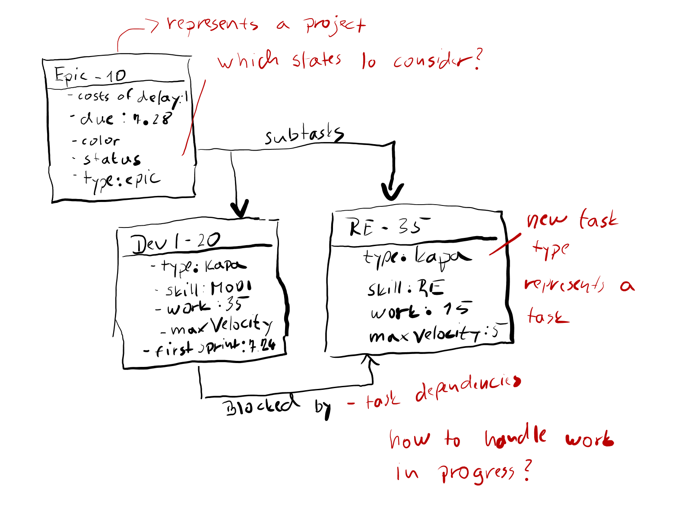

# kapa

This software plans work in an organization working in sprints:

This software is based on [OptaPlanner](https://www.optaplanner.org/)

## Running the application

The app expects 3 parameters: `app teams.xml projects.xml output.svg`

You can find sample configuration files in the `config` folder.

Alternatively you can run the application from the same folder as the location of this readme file.
Then the app will automatically use the sample configuration files and the output SVG will be 
generated in `kapaplanner/target/output.svg`.

Sample output:

## Problem space

See [docs/algorithm.pdf](https://github.com/peteral/kapa/blob/master/docs/algorithm.pdf) for discussion
on problem space size.

## Planning constraints

### Hard constraints
* All tasks must be planned
* Team skills
    * Teams are responsible for maintenance of modules created by them
    * New modules are distributed according to following constraints
        * Product features should be preferably developed by core teams
        * Customer specific one-time modules should be preferably developed by external teams
* Task dependencies
    * Some tasks must be finished before others
        * Analysis must be finished before the development can start
        * Platform feature required before customer-specific module can start development
* External dependencies
    * some tasks cannot start before a defined sprint because of external dependencies
* Cannot plan above sprint velocity
* Some tasks have maximal velocity per sprint
    * for example when only one person in team can work on the task
    * or if there are external waits (i.e. waiting for customer feedback during analysis phase)
* One task cannot be split between multiple teams event if the skills would allow it
        
### Soft constraints

* Minimize cost of delay
    * Not delivering committed feature on time leads to unsatisfied customers and even to penalties
    * Not creating a product feature lowers competitiveness and may even lead to loosing projects
    * Delivering  product feature ahead of schedule might be rewarding and therefore lead to negative costs of delay
* High sprint utilization
    * Sprints should be fully utilized

## Work unit

It does not really matter, which unit we use. Important is only, that the unit of work of a task is
the same as the velocity of the team which will handle it.

Person-Days might work as well as story points.

The task will be split up into chunks with the size of 1 work unit which will be planned.
For this reason velocities in the area of 10 - 100 might work well.

**!?** possibly this chunk size should be made a function of the velocity. 

## Domain model

Abbreviations:
* **f** - fact
* **a** - anchor
* **v** - planning variable
* **s** - shadow variable

### Team

* **f: Skills** - for example module development, analysis, etc.
* **s: Sprints** - sprint backlog split up in sprints

### Task

Tasks will be split into small sub tasks (1 unit of work?) so they can be easily planned.
Soft constraint pressure should lead to sub tasks being finished in the same sprint.

* **f: Skill** - sprint skill required for this task
* **f: previousTasks** - list of tasks which must be finished before this task can be started
* **f: firstPossibleSprint** - task cannot be started before this sprint (external dependency)
* **f: subTasks** - sub tasks for planning
* **f: work** - amount of work needed in person-days
* **f: project** - project this task belongs to
* **f: maxVelocity** - maximum velocity of this task per sprint (external waits, only 1 person in team can work on 
this task, etc.)
* **s: sprintViolatesMaxVelocity** - this shadow variable tells whether any sprint violates this task's max. velocity
* **s: firstSprint** - first sprint containing work on this task
* **s: lastSprint** - last sprint containing work on this task

* **!?** task lead time removed, the use case can always be solved by introducing an additional task as 
predecessor.

### Subtask

The subtask is the only real planning entity in our domain model. 

* **v: sprint** - sprint in which the work on this task starts
* **f: work** - amount of work needed in person-days
* **f: task** - parent task

Planning difficulty:
* tasks of project with fixed schedule are more difficult to plan that tasks without
* tasks with earlier project schedule are more difficult to plan than tasks with later project schedule
* tasks with higher costs of delay are more difficult to plan than tasks with lower costs of delay

### Project

Projects are high-level work units that need to be planned. Currently we only handle acquired projects , not the
sales pipeline.

See Sales pipeline discussion.

* **f: due** - project deadline - all projects must be finished until then
* **f: costOfDelay** - cost of delay **!?** we start simply with a number / sprint of delay, but this topic can get complex
* **f: tasks** - tasks belonging to this project
* **s: lastSprint** - last sprint containing work on this project

### Time Domain - Sprint

I have decided to make following assumptions for simplicity:

* we plan in sprints
* sprints are processed in sequence
* all teams have the same duration of sprints, event if they have different velocities
* the trick to handle task larger than a sprint and max task velocity per sprint is not planning the tasks
directly but split them into smaller chunks (sub-tasks) and plan them.

* **f: team** team to whose backlog this sprint belongs
* **f: velocity** the sprint's velocity in this sprint
* **f: name** sprints with same name are the same sprints (same column on time axis)

## Configuration files

### Teams

This file defines teams, their skills and sprints to be planned.
Sprints with the same name in different teams are considered the same sprints.
The sprint names must be ascending.

For example see [config/teams-1.xml](https://github.com/peteral/kapa/blob/master/config/teams-1.xml)

### Projects

This file defines the projects, their individual tasks, required skills and dependencies.

For example see [config/projects-1.xml](https://github.com/peteral/kapa/blob/master/config/projects-1.xml)

## Score function

The Score function is implemented as a [Drools](https://docs.jboss.org/drools/release/5.2.0.Final/drools-expert-docs/html/index.html) ruleset

Currently the function is embedded in the software under 
[src/main/resources/de/peteral/kapa/solver/score.drl](https://github.com/peteral/kapa/blob/master/kapaplanner/src/main/resources/de/peteral/kapa/solver/score.drl)

## Sales Pipeline Discussion

The sales pipeline contains projects that are not yet acquired, but eventually will be.

Following questions need to be answered during the sales phase:
* Is it possible to finish the project on time given the current commitment?
* What effect will the project acquisition have on our backlogs? How will it affect projects without deadline commitment?
* There are more than one projects in the pipeline, how will the effects be if we acquired some of them?

It is clear, that we should not go for a project which is not executable given our existing commitment.
But what if we have two projects with 50% chance of acquisition. Each one of the individually we could handle,
but both together would mean a disaster.  

I believe, the best approach would be the following:
* we handle the sales pipeline projects the same way as normal projects
* we generate multiple plans showing different scenarios and have a person decide:
    * acquired projects only - "worst case"
    * all acquired projects + sales pipeline - "best case"
    * acquired projects + selected projects from the sales pipeline
    
This can be handled outside of the planning software during input data generation and will therefore not be handled
here.

# JIRA integration

## JIRA data model

* Projects can be defined as epics, following properties are interesting:
    * **ID** - JIRA ID
    * **Name** - Name for better output readability
    * **costsOfDelay** - optional costs of delay per sprint. S,M,L,XL Looks like a good enough scala to me.
    * **due** - name of the sprint this epic is due (costs of delay will be caused if late)
    * **color** - it might make sense to configure the color in the epic so the epics in updated plans have always
    the same color. We might also implement the color to be a function of the id, however the colors might get weird if
    we do so.
    * **status** - not all states should be considered for planning
        * sales pipeline - only on demand
        * TODO, Backlog, etc. - plan
        * work in progress - here we have an issue with reducing the work planned by work already done
        * Closed - ignore 
* For tasks we should create a new special task type i.e. "KAPA". This task type then represents the 
    high-level tasks we will be planning. Following properties are of interest:
    * **ID** - JIRA ID
    * **Name** - Task name - do we really need this? would need some kind of tooltips to display this info. 
    * **Skill** - Required team skill - for decision which teams can work on this task
    * **work** - Planned work
    * **maxVelocity** - optional max velocity per sprint
    * **sprints** - sprints this tasks is planned for (!? multiple sprints per task should be possible in JIRA)
    * **firstSprint** - first possible sprint for this task's execution (external dependency)
    * **blockedBy** - list of tasks blocking this task, they must have following properties in order to be 
    considered:
        * be of type KAPA
        * belong to an EPIC, which will match the criteria for planning
        * cycles must not be allowed - we will only consider blockedBy dependency and should check for cycles

## JIRA Export

Takes JIRA query and transforms the returned KAPA Tasks / EPICS into Planner input file.
    
## Feedback to JIRA

Tasks / EPICs should be updated according to a plan automatically and used as base for the 
next planning.

Update sprints of tasks according to a planned schedule.