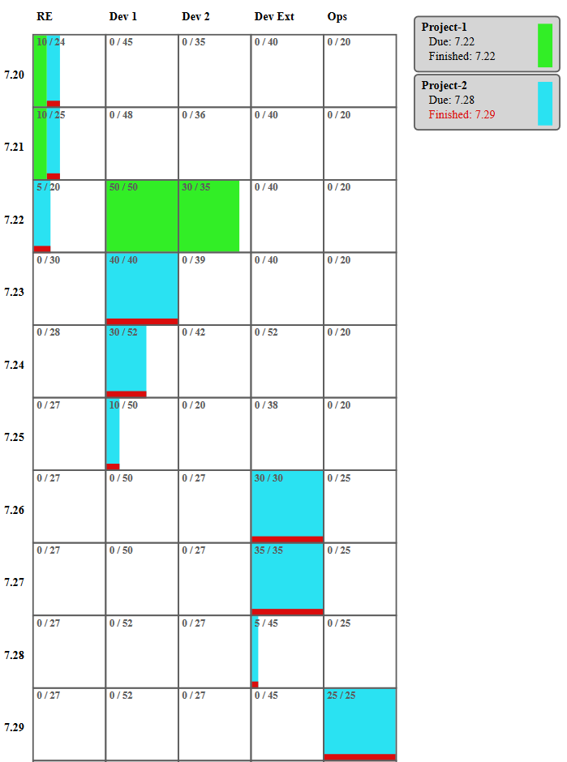

# kapa

## System overview 

This software is based on [OptaPlanner](https://www.optaplanner.org/)

## Planning constraints

### Hard constraints
* Team skills
    * Teams are responsible for maintenance of modules created by them
    * New modules are distributed according to following constraints
        * Product features should be preferably developed by core teams
        * Customer specific one-time modules should be preferably developed by external teams
* Task dependencies
    * Some projects must be finished before others
        * Analysis must be finished before the development can start
        * Platform feature required before customer-specific module can start development
        
### Soft constraints

* Minimize cost of delay
    * Not delivering committed feature on time leads to unsatisfied customers and even to penalties
    * Not creating a product feature lowers competitiveness and may even lead to loosing projects
    * Delivering  product feature ahead of schedule might be rewarding and therefore lead to negative costs of delay
* High sprint utilization
    * Teams should be fully utilized

## Work unit

For simplicity we will start with person-days as work unit.

The sprint velocities will be defined in person-days / day.

## Domain model

Abbreviations:
* **f** - fact
* **a** - anchor
* **v** - planning variable
* **s** - shadow variable

### Team

* **f: Skills** - for example module development, analysis, etc.
* **s: Sprints** - sprint backlog split up in sprints

### Task

Tasks will be split into small sub tasks (1 unit of work?) so they can be easily planned.
Soft constraint pressure should lead to sub tasks being finished in the same sprint.

* **f: Skill** - sprint skill required for this task
* **f: blockedBy** - list of projects which must be finished before this task can be started
* **f: firstPossibleSprint** - task cannot be started before this sprint (external dependency)
* **f: subTasks** - sub tasks for planning
* **f: work** - amount of work needed in person-days
* **s: delayCost** - current cost of delay for this task (project.costsOfDelay * sprintsDue)
* **f: project** - project this task belongs to
* **f: maxVelocity** - maximum velocity of this task per sprint (external waits, only 1 person in team can work on 
this task, etc.)

* **!?** task lead time removed, the use case can always be solved by introducing an additional task as 
predecessor.

### Subtask

* **v: sprint** - sprint in which the work on this task starts
* **f: work** - amount of work needed in person-days
* **f: task** - parent task

### Project

* **f: due** - project deadline - all projects must be finished until then
* **f: probability** - probability of project intake
    * projects with 30% intake-probability will only block 30% of capacity
    * **!?** still not persuaded, this is a good idea - let's consider following situation:
        * we have a commitment for 90 of 100 units of our capacity for the next 12 months
        * there is a project in the pipeline with 33% probability worth 30 units of capacity, but it must be finished within the next 12 months
        * our plan will say to go for the project, 33% of 30 units is 10 units
        * getting the project sounds great
        * however in reality the moment we get the project we will have a big problem because of an overcommitment
    * maybe we could add an constraint saying, that no project in the pipeline is allowed to be bigger, than the remaining unplanned capacity 
* **f: costOfDelay** - cost of delay **!?** we start simply with a number / sprint of delay, but this topic can get complex
* **f: tasks** - tasks belonging to this project

### Time Domain - Sprint

I have decided to make following assumptions for simplicity:

* we plan in sprints
* sprints are done in sequence
* all teams have the same duration of sprints 
* the trick to handle task larger than a sprint and max task velocity per sprint is not planning the tasks
directly but split them into smaller chunks (sub-tasks) and plan them.

* **f: sprint** sprint to whose backlog this sprint belongs
* **f: velocity** the sprint's velocity in this sprint
* **f: name** sprints with same name are the same sprints (same column on time axis)

## Visualization

* Backlog per sprint with time axis
* **!?** how should we visualize variable speed?
* Tasks of each project have different background
* Tasks past due date have red border
* Dummy projects show as empty space

